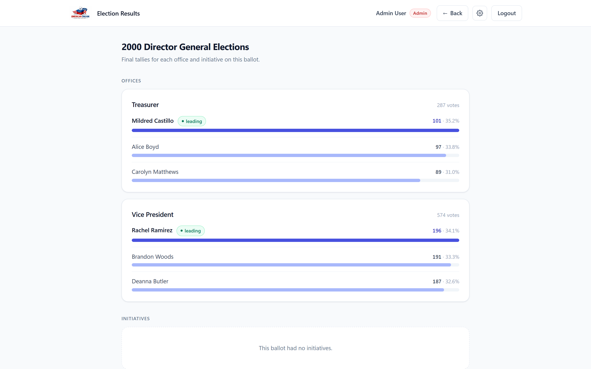
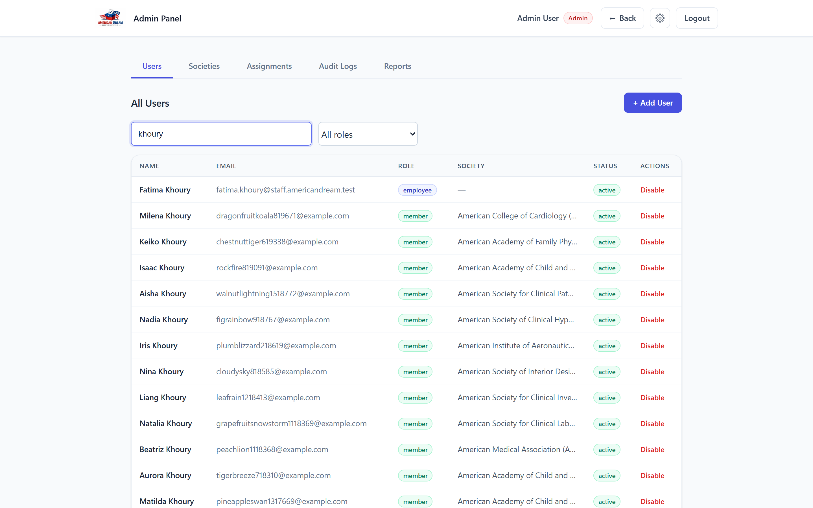
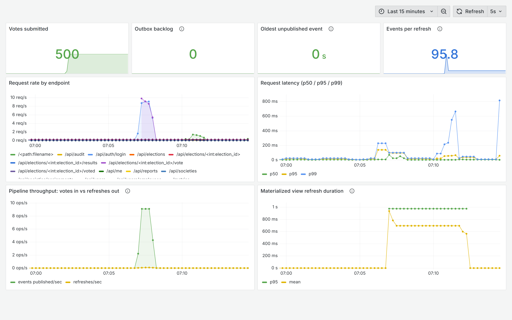

# American Dream Election System

Runs elections for professional societies like IEEE and ACM. Every society is a
separate tenant, so its members, elections and results are never visible to any
other society.

Flask and PostgreSQL, with vote events going through Kafka so that publishing
results doesn't slow down voting. Database, broker, app, workers and monitoring
all start with one command.

```bash
docker compose up -d --build
```

Loaded with 20,000 members, 2,000 elections, 500,000 ballots and 1.36M vote
records.

---

## What it looks like

Results are read from pre-computed materialized views. Bars scale against the
leader, not the total. With four or five candidates, scaling to the total makes
every bar a stub and you can't compare them.



The member roster is paged and searched in the database. Returning all 20,000
rows was a 4.3MB response; a page is 5.4KB.



## The pipeline under load

This is the whole point of the design. Running 500 concurrent votes,
**events published** (green) climbs with traffic while **refreshes** (yellow)
stays flat. The consumer batches any number of vote events into at most one
refresh per interval.



500 votes, 500 events, **5 refreshes**. Refreshing per vote would have been
about 500 x 650ms of aggregation. It took 3.5 seconds. Outbox backlog stayed at
zero and nothing was lost.

[Event Pipeline](#event-pipeline) covers why it's built this way.

---

## Tech Stack

| Layer | Technology |
|---|---|
| Backend | Python 3 / Flask |
| Database | PostgreSQL 16 (psycopg3) |
| Frontend | Vanilla JS + Tailwind CSS |
| Auth | Flask sessions + bcrypt |
| Events | Apache Kafka 3.9 (KRaft mode) |
| Monitoring | Prometheus + Grafana |
| Local infrastructure | Docker Compose |
| Server | Gunicorn (production) |

---

## Architecture

Strict 3-layer separation:

```
HTTP Request
    ↓
app/routes/api_routes.py      ← REST layer: HTTP in/out, owns transactions (with db:)
    ↓
app/services/                 ← Business layer: role checks, validation, state rules
    ↓
app/repositories/             ← Data layer: raw parameterized SQL only
    ↓
PostgreSQL
```

**Transactions belong to the route layer**, using psycopg3's `with db:` context manager. It commits on success and rolls back on any exception. Services never call `commit()` or `rollback()`. They let exceptions propagate so the route can roll back the whole request.

**No N+1 queries.** Candidates come back with their offices in one JOIN, options with their initiatives in another. Grouping happens in Python.

---

## Advanced Database Features

| Feature | Where |
|---|---|
| Materialized views | `mv_candidate_results`, `mv_initiative_results`: pre-computed vote tallies |
| Stored procedure | `refresh_election_results()` refreshes both materialized views atomically |
| SELECT FOR UPDATE | `get_election_for_update()` in `election_repository.py` stops concurrent ballot edits |
| Bulk loading | `COPY`-based import of the 1.9M-row historical dataset |
| Transactional outbox | `event_outbox` commits events with the vote that produced them |
| SKIP LOCKED | `claim_unpublished()` in `outbox_repository.py` lets relays scale horizontally |
| Parameterized queries | All SQL uses `%s` placeholders throughout repositories |

---

## Project Structure

```
election-system/
├── app/
│   ├── __init__.py              # App factory, blueprint registration, static file serving
│   ├── config.py                # Config from .env
│   ├── db.py                    # psycopg3 connection with dict_row
│   ├── routes/
│   │   └── api_routes.py        # All REST endpoints
│   ├── services/
│   │   ├── auth_service.py      # Login, password verification
│   │   ├── ballot_service.py    # Election creation, ballot save/publish
│   │   ├── voting_service.py    # Vote submission (role + society + duplicate checks)
│   │   ├── election_service.py  # Role-based election listing + ballot fetch
│   │   ├── results_service.py   # Results access with role restrictions
│   │   ├── society_service.py   # Society management
│   │   └── user_service.py      # Admin user management
│   └── repositories/
│       ├── election_repository.py
│       ├── office_repository.py
│       ├── initiative_repository.py
│       ├── candidate_repository.py
│       ├── vote_repository.py
│       ├── society_repository.py
│       ├── audit_repository.py
│       ├── outbox_repository.py
│       └── user_repository.py
├── workers/
│   ├── outbox_relay.py          # Publishes committed events to Kafka
│   └── results_consumer.py      # Debounced materialized view refresh
├── scripts/
│   ├── load_test.py             # Concurrent voting load test
│   ├── enrich_demo_data.py      # Roles, staff accounts and name variety
│   └── capture_screenshots.py   # Regenerates the README screenshots
├── frontend/                    # Served directly by Flask (send_from_directory)
│   ├── login.html
│   ├── dashboard.html / dashboard.js
│   ├── ballot.html / ballot.js
│   ├── ballot-editor.html / ballot-editor.js
│   ├── results.html / results.js
│   ├── participation.html / participation.js
│   ├── pending-tasks.html / pending-tasks.js
│   ├── admin.html / admin.js
│   ├── settings.html / settings.js
│   └── components.js            # Shared navbar, footer, alerts
├── data/                        # Raw source dataset (pipe-separated)
│   ├── societies.txt
│   ├── members.psv
│   ├── dirty.psv
│   ├── elections.psv
│   ├── candidates.psv
│   └── votes.psv
├── database/
│   ├── schema.sql               # Schema (tables, constraints, indexes)
│   ├── materialized_view.sql    # Materialized views + stored procedure
│   ├── import_election_data.py  # Bulk loader for the historical dataset
│   └── seed.py                  # Demo accounts + one active election
├── tests/
│   └── test_*.py                # 45 unit tests (service layer)
├── docs/screenshots/            # README images (regenerated, not hand-taken)
├── observability/
│   ├── prometheus.yml           # Scrape config
│   └── grafana/                 # Provisioned datasource + dashboard
├── Dockerfile                   # App image (production + dev targets)
├── docker-compose.yml           # Postgres + Kafka + app + workers + monitoring
├── .dockerignore
├── run.py                       # Start the app for development
├── server.py                    # Start the app in production (via Gunicorn)
├── requirements.txt
├── requirements-dev.txt
└── .env                         # Not committed, see setup below
```

---

## Event Pipeline

### The problem

Results come from two materialized views. Refreshing them re-aggregates every
`candidate_vote` row. On the full dataset of 1.36M rows that takes **698ms**.
Submitting a vote takes about **21ms**.

Neither synchronous option works:

- **Refresh on every vote** makes voting 30x slower. `REFRESH MATERIALIZED VIEW
  CONCURRENTLY` also can't overlap itself, so concurrent voters queue behind
  each other. At 100 votes/second you'd need 70 seconds of refresh work per
  second, which is impossible.
- **Never refresh** is what it did before. Only the bulk importer ever called
  the refresh, so `/api/elections/<id>/results` served stale tallies forever.

### The design

```
POST /vote
    │
    ├── vote, candidate_vote, audit, event_outbox   ← one transaction
    │
    ▼
event_outbox (PostgreSQL)
    │
    │   outbox relay  (workers/outbox_relay.py)
    ▼
Kafka topic: election.vote.cast   (3 partitions, keyed by election_id)
    │
    │   results consumer  (workers/results_consumer.py)
    ▼
CALL refresh_election_results()   ← at most once per REFRESH_INTERVAL_SECONDS
```

**Transactional outbox.** The vote request never touches Kafka. It writes the
event into `event_outbox` in the same transaction as the vote, so the event
exists only if the vote committed. A separate relay moves those rows to the
broker.

This avoids the dual-write problem. If you write to Postgres and Kafka as two
separate operations, a failure in between either loses the event or announces a
vote that got rolled back. It also means **Kafka can be down and people can
still vote**. Events pile up in the table and drain once the broker is back.

**Debounced refresh.** The consumer batches any number of vote events into one
refresh per interval. Refresh cost stays at roughly 700ms per interval no matter
how fast votes arrive, and results are never more than one interval behind.

### Delivery guarantees

| Concern | Handling |
|---|---|
| Event lost if the app crashes after commit | Can't happen. The event is part of that commit |
| Broker unavailable | Rows stay unpublished and are retried; voting is unaffected |
| Relay crashes after publishing, before marking | Event republishes (at-least-once) |
| Duplicate delivery | Harmless. A refresh recomputes from base tables, so it's idempotent |
| Multiple relay instances | `FOR UPDATE SKIP LOCKED` gives each a disjoint batch |
| Ordering within an election | Events are keyed by `election_id`, so one election maps to one partition |

The event payload leaves out who voted. Consumers only need to know a vote
landed and which election it was in.

### Measured

`scripts/load_test.py` drives concurrent voters against the running stack:

```bash
python scripts/load_test.py --voters 300 --concurrency 25
```

300 ballots at concurrency 25, against 2 Gunicorn workers:

| | |
|---|---|
| Votes accepted | 300 / 300 |
| Throughput | 28 votes/sec |
| Latency p50 / p95 / p99 | 422ms / 625ms / 641ms |
| Events published | 300, **0 lost** |
| Materialized view refreshes | **2** |

Those 300 votes collapsed into 2 refreshes of ~580ms each. Refreshing inline on
each vote would have cost roughly `300 x 650ms = 195 seconds` of aggregation;
the pipeline did it in about 1.2 seconds, roughly 160x less.
After the run the view total matched the raw vote count exactly (302 = 302).

The bottleneck in that test is the web tier, not the database or the broker.
Two synchronous Gunicorn workers handling two requests per vote (login, then
vote) accounts for the throughput. More workers is the fix.

---

## Observability

Prometheus scrapes the app and both workers. Grafana comes with the dashboard
already provisioned, so `docker compose up` gives you working graphs with no
setup.

| Service | URL |
|---|---|
| Grafana dashboard | http://localhost:3001 |
| Prometheus | http://localhost:9090 |
| App metrics | http://localhost:3000/metrics |

### What is measured

| Metric | Why it matters |
|---|---|
| `election_http_request_duration_seconds` | Request latency, labelled by Flask rule instead of raw path so 2,000 elections don't become 2,000 separate time series |
| `election_votes_submitted_total` | Accepted ballots |
| `election_outbox_pending_events` | Backlog depth: events written but not yet on the broker |
| `election_outbox_oldest_pending_seconds` | **The one that matters.** Depth on its own is ambiguous: a big backlog that's draining is fine, a small one that never empties isn't. Age tells you whether the relay is keeping up |
| `election_results_refresh_duration_seconds` | Refresh cost, which grows with vote volume |
| `election_results_refreshes_total` | Refresh count. Compare against events consumed to see the debounce working |

The "Pipeline throughput" panel plots events published against refreshes
performed. Under load the first climbs and the second stays flat.

Gunicorn runs several workers, so the app uses `prometheus_client`'s
multiprocess mode. Workers pool their counters in a shared directory
(`PROMETHEUS_MULTIPROC_DIR`) and `/metrics` adds them up. Without it every scrape
would report whichever worker happened to answer.

---

## Roles & Access

| Role | Access |
|---|---|
| `member` | Vote on active elections in their society; view results of completed elections |
| `officer` | Vote + view voter participation (who voted/who hasn't) + view completed election results |
| `employee` | Assigned to societies; build & publish ballots, view results, view participation, manage pending tasks |
| `admin` | Everything + manage users, societies, employee assignments, audit logs, and reports |

---

## Election States

```
draft → active → completed
```

- **draft**: ballot can be edited by employees/admins
- **active**: members/officers can vote; ballot is locked; each user can only vote once
- **completed**: voting closed; results visible to employees, admins, and officers

---

## API Endpoints

| Method | Path | Access | Description |
|---|---|---|---|
| POST | `/api/auth/login` | Public | Login |
| POST | `/api/auth/logout` | Auth | Logout |
| GET | `/api/me` | Auth | Current user info |
| PUT | `/api/me` | Auth | Update own name |
| PUT | `/api/me/password` | Auth | Change own password |
| GET | `/api/elections` | Auth | List elections (role-filtered) |
| POST | `/api/elections` | Employee/Admin | Create election |
| GET | `/api/elections/<id>` | Auth | Get election + full ballot |
| PUT | `/api/elections/<id>/ballot` | Employee/Admin | Save ballot (draft only) |
| POST | `/api/elections/<id>/publish` | Employee/Admin | Publish election |
| GET | `/api/elections/<id>/voted` | Auth | Check if current user has voted |
| POST | `/api/elections/<id>/vote` | Member/Officer | Submit vote |
| GET | `/api/elections/<id>/results` | Employee/Admin/Officer | View results |
| GET | `/api/elections/participation` | Officer/Employee/Admin | Turnout stats + member roster for active elections |
| GET | `/api/elections/pending` | Employee | Draft elections in assigned societies needing a ballot |
| GET | `/api/elections/<id>/members` | Officer/Employee/Admin | Per-election member voted/not-voted roster |
| GET | `/api/societies` | Admin/Employee | List societies |
| POST | `/api/societies` | Admin | Create society |
| GET | `/api/societies/assignments` | Admin | List employee–society assignments |
| GET | `/api/users` | Admin | List users, paged (`search`, `role`, `limit`, `offset`) |
| GET | `/api/users/employees` | Admin | List employees (for the assignment picker) |
| POST | `/api/users` | Admin | Create user |
| PUT | `/api/users/<id>` | Admin | Update user (status, role, etc.) |
| POST | `/api/users/<id>/societies` | Admin | Assign employee to society |
| DELETE | `/api/users/<id>/societies/<sid>` | Admin | Remove employee from society |
| GET | `/api/audit` | Admin | Ballot edit events + vote activity log |
| GET | `/api/reports` | Admin | System-wide stats + per-society stats |

---

## Setup

### 1. Configure environment

Create a `.env` file in the project root (never commit this). Docker Compose and
the app both read it, so credentials live in one place:

```
DB_HOST=localhost
DB_PORT=5433
DB_NAME=american_dream
DB_USER=appuser
DB_PASSWORD=devpassword
SECRET_KEY=<random string>
FLASK_ENV=development
```

Generate a secret key with:

```bash
python -c "import secrets; print(secrets.token_hex(32))"
```

> **Port note:** `5433` is used instead of the default `5432` to avoid colliding
> with any PostgreSQL already installed on the host machine. Change it if `5433`
> is taken. Inside the Docker network the app reaches the database at
> `postgres:5432`. The `5433` mapping only applies from your machine.

### 2. Start the stack

```bash
docker compose up -d --build
```

This starts five containers:

| Container | Role |
|---|---|
| `election_postgres` | PostgreSQL 16 |
| `election_kafka` | Kafka 3.9 broker (KRaft, no ZooKeeper) |
| `election_app` | Flask app under Gunicorn |
| `election_relay` | Publishes outbox events to Kafka |
| `election_results_consumer` | Refreshes results views on a debounce |
| `election_prometheus` | Scrapes metrics from the app and workers |
| `election_grafana` | Dashboard at http://localhost:3001 |

The app and workers wait for their dependencies to report healthy before starting.

### 3. Create the schema

```bash
docker compose exec -T postgres psql -U appuser -d american_dream < database/schema.sql
docker compose exec -T postgres psql -U appuser -d american_dream < database/materialized_view.sql
```

### 4. Load data

Demo accounts plus one active election to vote in:

```bash
docker compose exec app python database/seed.py
```

Optionally, load the full historical dataset (20,000 members, 2,000 elections,
500,000 ballots, 1.36M individual selections) from the files in `data/`:

```bash
docker compose exec app python database/import_election_data.py --reset
docker compose exec app python database/seed.py
```

`--reset` truncates all data tables first, since the source files carry explicit
primary keys. Run `seed.py` afterwards to re-create the demo accounts. The import
takes roughly 75 seconds and uses `COPY` rather than row-by-row inserts.

Finally, make the dataset usable as a demonstration:

```bash
python scripts/enrich_demo_data.py
```

Everyone in the source data is a plain member, and the names come from a pool of
177 first names and 256 surnames. So no society has officers or staff, and the
member list repeats the same handful of surnames. This script gives each society
officers, creates the staff accounts that run elections, and widens the name
pool. It's deterministic and safe to re-run. It only touches names, roles and
assignments, so every vote, ballot and election stays exactly as imported.

The app is now served at `http://localhost:3000`.

---

## Local Development

The containers are enough to run the app, but a local virtualenv is useful for
running tests and for Flask's auto-reloading dev server:

```bash
python -m venv venv
source venv/Scripts/activate      # Windows; use venv/bin/activate on macOS/Linux
pip install -r requirements-dev.txt
python run.py
```

`run.py` connects to the containerized database over the `5433` host mapping, so
`docker compose up -d postgres` is enough if you only want the database.

### Container images

The `Dockerfile` has two targets:

| Target | Contains | Used for |
|---|---|---|
| `production` (default) | `requirements.txt` only, runs Gunicorn | `docker compose up` |
| `dev` | adds `requirements-dev.txt` (pytest) | running tests in a container |

```bash
docker build --target dev -t election-app:dev .
```

Both run as an unprivileged `appuser`, not root. `data/` is mounted read-only
rather than copied into the image, so the image stays lean.

---

## Demo Accounts

Created by `seed.py`. All passwords: `password123`

| Email | Name | Role | Society |
|---|---|---|---|
| `admin@example.com` | Admin User | admin | — |
| `employee@example.com` | Emma Ployee | employee | IEEE + ACM |
| `officer@example.com` | Oliver Ficer | officer | IEEE |
| `member@example.com` | Mary Member | member | IEEE |
| `member2@example.com` | Mark Two | member | ACM |

Accounts from the bulk import also use `password123`, with emails formed as
`<username><member_id>@example.com`.

---

## Historical Dataset

The pipe-separated files in `data/` hold a historical dataset spanning elections
from 2000 to 2025:

| File | Contents |
|---|---|
| `societies.txt` | 80 professional societies |
| `members.psv` | 20,000 members |
| `dirty.psv` | 300 member corrections requiring cleanup |
| `elections.psv` | 2,000 elections |
| `candidates.psv` | 4,966 offices and 12,451 candidates |
| `votes.psv` | 1,395,092 ballot selections |

`import_election_data.py` handles three quirks in this data:

- **`dirty.psv`** has duplicate rows, society IDs written as `.10` instead of `10`,
  blank roles and mixed line endings. The importer de-duplicates, repairs and
  defaults these.
- **Undervotes.** 39,454 rows are a member skipping an office with no candidate
  selected. The `chk_candidate_or_writein` constraint has no way to represent
  "abstained", so these get counted and reported but not stored. The ballot still
  shows the member voted.
- **Multi-seat offices.** 614 offices allow 2 votes, so the same member showing up
  twice for one office is correct, not a duplicate. The importer keeps these and
  checks no ballot goes over its office's `votes_allowed`.

Elections are imported as `completed` and attributed to a `system@americandream.local`
account, since the source data has no creator column and `election.created_by` is `NOT NULL`.

---

## Running Tests

Locally, with the virtualenv active:

```bash
python -m pytest tests/ -v
```

Or in a container, using the `dev` image:

```bash
docker build --target dev -t election-app:dev .
docker run --rm --network multi-tenant-election-management-platform-main_default \
  -e DB_HOST=postgres -e DB_PORT=5432 -e DB_NAME=american_dream \
  -e DB_USER=appuser -e DB_PASSWORD=devpassword \
  election-app:dev python -m pytest tests/ -q
```

45 unit tests covering the service layer:

| File | Tests | Covers |
|---|---|---|
| `test_auth_service.py` | 7 | Login and password verification |
| `test_election_service.py` | 10 | Role-based election listing and ballot access |
| `test_voting_service.py` | 15 | Vote submission rules, transaction contract, outbox |
| `test_user_service.py` | 13 | Admin access, page-size clamping, search and role filters |

Repositories and the remaining services (`ballot`, `results`, `society`) are not
yet covered.
